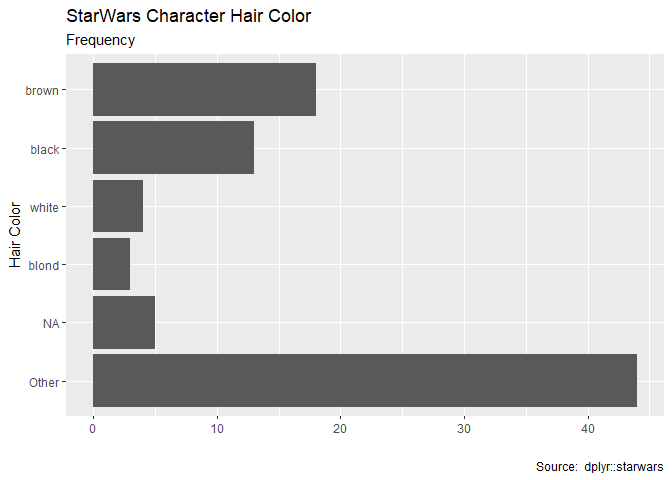
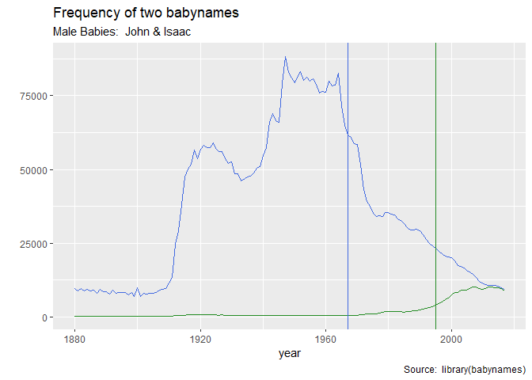
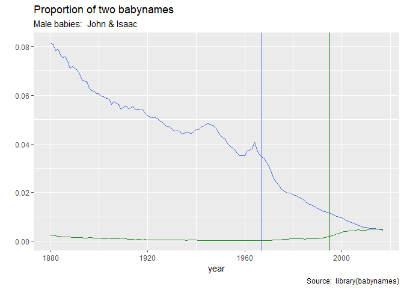

00 Start Here
================
John Little
2019-10-28

Let’s use a few useful library packages

  - [tidyverse](https://www.tidyverse.org/)
  - [PowerPoint Presentation with
    RStudio](https://support.rstudio.com/hc/en-us/articles/360004672913-Rendering-PowerPoint-Presentations-with-RStudio)
  - [xaringan](https://github.com/yihui/xaringan) Slides
  - [flexdashboard](https://rmarkdown.rstudio.com/flexdashboard/)

<!-- end list -->

``` r
if(!require(tidyverse)) {
  install.packages(tidyverse)
}
```

    ## Loading required package: tidyverse

    ## -- Attaching packages --------------------------------------------------------------------------- tidyverse 1.2.1 --

    ## v ggplot2 3.2.1     v purrr   0.3.3
    ## v tibble  2.1.3     v dplyr   0.8.3
    ## v tidyr   1.0.0     v stringr 1.4.0
    ## v readr   1.3.1     v forcats 0.4.0

    ## -- Conflicts ------------------------------------------------------------------------------ tidyverse_conflicts() --
    ## x dplyr::filter() masks stats::filter()
    ## x dplyr::lag()    masks stats::lag()

``` r
library(tidyverse)

if(!require(xaringan)) {
  install.packages(xaringan)
}
```

    ## Loading required package: xaringan

``` r
library(xaringan)


if(!require(flexdashboard)) {
  install.packages("flexdashboard")
}
```

    ## Loading required package: flexdashboard

``` r
library(flexdashboard)

if(!require(babynames)) {
  install.packages("babynames")
}
```

    ## Loading required package: babynames

``` r
library(babynames)
```

## Example code & objects

### Hair color barplot

``` r
hair_color_barplot <- starwars %>%
  ggplot(aes(fct_rev(fct_other(
    fct_lump_min(fct_explicit_na(fct_infreq(hair_color), "NA"), 2), drop = "none"
  )))) +
  geom_bar() +
  coord_flip() +
  labs(title = "StarWars Character Hair Color",
       subtitle = "Frequency",
       x = "Hair Color", y = "",
       caption = "Source:  dplyr::starwars")
hair_color_barplot
```

<!-- -->

## Baby Names linegraph

``` r
babynames_john_n <-
  ggplot() +
  geom_line(data = babynames %>% filter(name == "John", sex == "M"),
            aes(year, n),
            color = "royalblue") +
  geom_line(data = babynames %>% filter(name == "Isaac", sex == "M"),
            aes(year, n),
            color = "forestgreen") +
  geom_vline(xintercept = 1967, color = "royalblue") +
  geom_vline(xintercept = 1995, color = "forestgreen") +
  labs(
    title = "Frequency of two babynames",
    subtitle = "Male Babies:  John & Isaac",
    y = "",
    caption = "Source:  library(babynames)"
  )
babynames_john_n
```

<!-- -->

``` r
babynames_john_prop <-   ggplot() +
  geom_line(
    data = babynames %>% filter(name == "John", sex == "M"),
    aes(year, prop),
    color = "royalblue"
  ) +
  geom_line(
    data = babynames %>% filter(name == "Isaac", sex == "M"),
    aes(year, prop),
    color = "forestgreen"
  ) +
  geom_vline(xintercept = 1967, color = "royalblue") +
  geom_vline(xintercept = 1995, color = "forestgreen") +
  labs(
    title = "Proportion of two babynames",
    subtitle = "Male babies:  John & Isaac",
    y = "",
    caption = "Source:  library(babynames)"
  )
babynames_john_prop
```

<!-- -->

### Save the Objects

``` r
ggsave("images/hair_color_barplot.png", plot = hair_color_barplot)
```

    ## Saving 7 x 5 in image

``` r
ggsave("images/babynames_n.png", plot = babynames_john_n)
```

    ## Saving 7 x 5 in image

``` r
ggsave("images/babynames_prop.png", plot = babynames_john_prop)
```

    ## Saving 7 x 5 in image

## PowerPoint Presentation

[Quick Start
Documenation](https://support.rstudio.com/hc/en-us/articles/360004672913-Rendering-PowerPoint-Presentations-with-RStudio)

1.  `New File > R Markdown > Presentation > PowerPoint`


## Xaringan Slides

[Quick Start Documentation](https://slides.yihui.name/xaringan/)

[Docs from R Markdown Book by Yihui
Xie](https://bookdown.org/yihui/rmarkdown/xaringan.html)

1.  `New File > R Markdown > From Template > Ninja Presentation`

## Dashboard

1.  `New File > R Markdown > From Template > Flex Dashboard`

[Quick Start
Documentation](https://rmarkdown.rstudio.com/flexdashboard/)

[Docs from R Markdown book by Yihui
Xie](https://bookdown.org/yihui/rmarkdown/dashboards.html)
